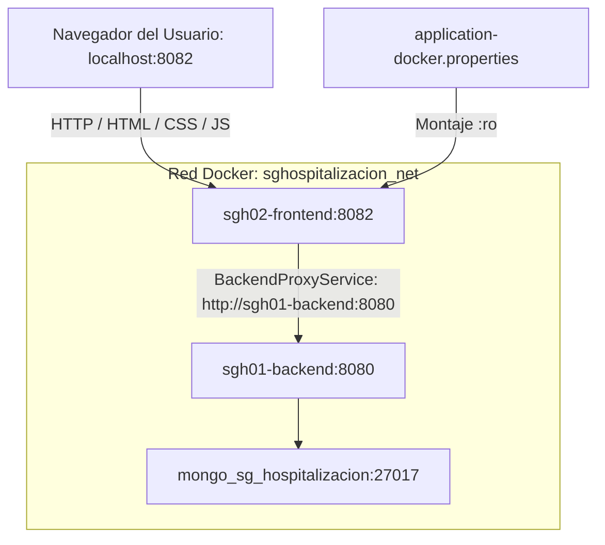

# Guía de Dockerización y Despliegue con Docker Compose — SGHospitalizacion02 (Frontend / BFF)

Esta guía explica, de forma práctica, exhaustiva y estructurada, cómo ejecutar el frontend web y Backend-For-Frontend (BFF) **SGHospitalizacion02** (Spring Boot 4 / Java 21 / Thymeleaf / AdminLTE 3) en Docker y conectarlo con el backend clínico **SGHospitalizacion01** a través de una red Docker compartida.

---

## Índice
1. [Qué resuelve esta guía](#1-qué-resuelve-esta-guía)
2. [Arquitectura (BFF y Comunicación entre Contenedores)](#2-arquitectura-bff-y-comunicación-entre-contenedores)
3. [Archivos del proyecto usados en la dockerización](#3-archivos-del-proyecto-usados-en-la-dockerización)
4. [Despliegue Paso a Paso](#4-despliegue-paso-a-paso)
5. [Ciclo Completo: Escritura del Dockerfile, Build de Imagen y Commit Local](#5-ciclo-completo-escritura-del-dockerfile-build-de-imagen-y-commit-local)
6. [Flujo de configuración](#6-flujo-de-configuración)
7. [Verificación y diagnóstico rápido](#7-verificación-y-diagnóstico-rápido)
8. [Operaciones de día a día (Ciclo de vida)](#8-operaciones-de-día-a-día-ciclo-de-vida)
9. [Solución de problemas comunes](#9-solución-de-problemas-comunes)
10. [Buenas prácticas y notas de seguridad](#10-buenas-prácticas-y-notas-de-seguridad)

---

## 1. Qué resuelve esta guía
* **Despliegue aislado del cliente web**: Ejecutar la interfaz de usuario en `0.0.0.0:8082` dentro de Docker y publicarla en el puerto `8082` del host.
* **Patrón Backend Proxy (BFF)**: Las llamadas desde el navegador hacia `/api/...` son recibidas por el frontend y retransmitidas del lado del servidor al backend (`sgh01-backend:8080`), propagando automáticamente las cookies de autenticación (`JWT_TOKEN`).
* **Configuración desacoplada**: Montar `application-docker.properties` en tiempo de ejecución para modificar la URL del backend sin necesidad de reconstruir la imagen de Docker.
* **Red compartida (`sghospitalizacion_net`)**: Conexión transparente mediante resolución DNS nativa de Docker con el backend y MongoDB.

---

## 2. Arquitectura (BFF y Comunicación entre Contenedores)



* **Contenedor Frontend (`sgh02-frontend`)**:
  * Construido con `Dockerfile` multi-stage (JDK 21 para compilar → JRE 21 para ejecución).
  * Expone el puerto `8082` en el host.
  * Reenvía peticiones REST internas hacia el backend mediante `BackendProxyService.java`.
* **Red (`sghospitalizacion_net`)**:
  * Red bridge fija que conecta `sgh02-frontend` con `sgh01-backend`.

---

## 3. Archivos del proyecto usados en la dockerización

* **Dockerfile**: Multi-stage build con Eclipse Temurin 21. Define `SERVER_PORT=8082`, `SERVER_ADDRESS=0.0.0.0` y `SPRING_CONFIG_ADDITIONAL_LOCATION`.
* **docker_compose_sghospitalizacion02.yml**: Servicio `app` (contenedor: `sgh02-frontend`), puertos `8082:8082`, montaje de properties `:ro`.
* **src/main/resources/application-docker.properties**: Archivo de configuración en tiempo de ejecución montado en el contenedor.
* **.env.example**: Plantilla de variables para Docker.
* **DockerComposeAutomation.sh**: Script automatizado para Linux/macOS.
* **DockerEnvironmentSetup.ps1**: Script automatizado para Windows PowerShell.

---

## 4. Despliegue Paso a Paso

Sigue esta secuencia ordenada para desplegar la interfaz web / BFF conectada a los servicios clínicos.

### Paso 1: Requisitos previos y verificación de dependencias
1. Asegurar que Docker y Docker Compose (v2) estén en funcionamiento.
2. Comprobar que el puerto **8082** esté libre en el equipo anfitrión:
   ```bash
   lsof -i :8082 || echo "Puerto 8082 disponible"
   ```
3. *(Recomendado)* Verificar que el backend `sgh01-backend` ya se encuentre en ejecución:
   ```bash
   docker ps --filter "name=sgh01-backend"
   ```

### Paso 2: Asegurar la red Docker compartida
```bash
# 1. Crear la red si no existe aún
docker network create sghospitalizacion_net 2>/dev/null || true

# 2. Comprobar que la red existe en el sistema
docker network ls | grep sghospitalizacion_net
```

### Paso 3: Configuración del enlace al backend y variables
1. Crear el archivo local `.env` a partir de la plantilla si requieres personalizar puertos:
   ```bash
   cp .env.example .env
   ```
2. Verificar que `src/main/resources/application-docker.properties` apunte al hostname del contenedor del backend:
   ```properties
   spring.application.name=SGHospitalizacion-Front
   server.address=0.0.0.0
   server.port=8082
   app.backend.base-url=http://sgh01-backend:8080
   spring.devtools.restart.enabled=false
   ```

### Paso 4: Ejecución del despliegue del Frontend

#### Opción A: Script Automatizado para Linux / macOS
```bash
chmod +x DockerComposeAutomation.sh
./DockerComposeAutomation.sh
```

#### Opción B: Script Automatizado para Windows PowerShell
```powershell
powershell -ExecutionPolicy Bypass -File .\DockerEnvironmentSetup.ps1
```

#### Opción C: Despliegue Manual con Docker Compose CLI
```bash
# 1. Compilar y empaquetar la imagen Docker
docker compose -f docker_compose_sghospitalizacion02.yml build

# 2. Levantar el servicio en segundo plano
docker compose -f docker_compose_sghospitalizacion02.yml up -d --remove-orphans
```

### Paso 5: Monitoreo de logs e inicialización
```bash
docker compose -f docker_compose_sghospitalizacion02.yml logs -f app
```
*Espera a observar la confirmación:*
```
Tomcat started on port 8082 (http) with context path '/'
Started SgHospitalizacion02Application in X.XXX seconds
```
Presiona `Ctrl + C` para volver a la terminal.

---

## 5. Ciclo Completo: Escritura del Dockerfile, Build de Imagen y Commit Local

Esta sección documenta el proceso íntegro desde la escritura del `Dockerfile` hasta el commit en la rama personal, para que puedas reproducirlo en cualquier proyecto Spring Boot que actúe como frontend o BFF.

### 5.1 Escritura del Dockerfile (Multi-Stage Build)

El `Dockerfile` se ubica en la raíz del proyecto. Utiliza un patrón de dos etapas idéntico al backend, con el puerto ajustado a `8082`:

**Contenido completo del `Dockerfile`:**
```dockerfile
# syntax=docker/dockerfile:1

# ═══════════════════════════════════════════════════════════════
# ETAPA 1: BUILD — Compilación con JDK 21
# ═══════════════════════════════════════════════════════════════
FROM eclipse-temurin:21-jdk AS build
WORKDIR /app

# 1. Copiar archivos del wrapper Maven y pom.xml primero (cacheo de dependencias)
COPY .mvn/ .mvn/
COPY mvnw pom.xml ./
RUN chmod +x mvnw

# 2. Descargar dependencias offline (aprovecha caché de Docker si pom.xml no cambia)
RUN ./mvnw -q -B -e -DskipTests dependency:go-offline || true

# 3. Copiar código fuente y empaquetar
COPY src ./src
RUN ./mvnw -q -B -DskipTests package

# ═══════════════════════════════════════════════════════════════
# ETAPA 2: RUNTIME — Imagen ligera solo con JRE 21
# ═══════════════════════════════════════════════════════════════
FROM eclipse-temurin:21-jre
ENV JAVA_OPTS="-Xms256m -Xmx512m"
ENV TZ=${TZ:-UTC}
WORKDIR /app

# Copiar SOLO el JAR compilado de la etapa anterior
COPY --from=build /app/target/*.jar app.jar

# Punto de montaje para configuración externa
ENV SPRING_CONFIG_ADDITIONAL_LOCATION="optional:file:/app/config/"
ENV SPRING_CONFIG_IMPORT="optional:file:/app/config/application.properties"

# Bind en todas las interfaces y puerto del frontend
ENV SERVER_ADDRESS=0.0.0.0
ENV SERVER_PORT=8082
EXPOSE ${SERVER_PORT}

ENTRYPOINT ["sh","-c","java $JAVA_OPTS -Dserver.address=${SERVER_ADDRESS} -Dserver.port=${SERVER_PORT} -Duser.timezone=${TZ} -Dspring.config.additional-location=${SPRING_CONFIG_ADDITIONAL_LOCATION} -Dspring.config.import=${SPRING_CONFIG_IMPORT} -jar app.jar"]
```

**Explicación de cada bloque:**

| Línea / Bloque | Propósito |
| :--- | :--- |
| `FROM eclipse-temurin:21-jdk AS build` | Imagen pesada con JDK 21. Se descarta al final. |
| `COPY .mvn/ + mvnw + pom.xml` | Copiar las definiciones Maven primero para cachear dependencias. |
| `dependency:go-offline` | Descarga todas las dependencias sin compilar. Acelera rebuilds. |
| `COPY src → package` | Copiar fuentes y generar el `.jar` ejecutable con Thymeleaf + AdminLTE. |
| `FROM eclipse-temurin:21-jre` | Imagen ligera (~250MB vs ~800MB). Solo runtime. |
| `COPY --from=build` | Trae el JAR de la primera etapa. El código fuente NO queda en la imagen. |
| `SPRING_CONFIG_ADDITIONAL_LOCATION` | Spring Boot busca properties en `/app/config/`. Se monta con Compose. |
| `SERVER_ADDRESS=0.0.0.0` | Acepta conexiones desde fuera del contenedor. |
| `SERVER_PORT=8082` | Puerto del frontend BFF (distinto al backend en 8080). |
| `ENTRYPOINT` | Lanza la JVM con las variables configuradas. |

### 5.2 Build de la Imagen Docker

Una vez creado el `Dockerfile`, construye la imagen localmente:

```bash
# Desde la raíz del proyecto SGHospitalizacion02/

# Opción 1: Build con Docker Compose (recomendado)
docker compose -f docker_compose_sghospitalizacion02.yml build

# Opción 2: Build directo con Docker CLI
docker build -t sghospitalizacion02-app:latest .
```

**Verificar que la imagen fue creada:**
```bash
docker images | grep sghospitalizacion02
```
Salida esperada:
```
sghospitalizacion02-app   latest   def456abc789   10 seconds ago   290MB
```

**Rebuild tras cambios en templates HTML, CSS o Java:**
```bash
# Sin caché (reconstruye todo desde cero)
docker compose -f docker_compose_sghospitalizacion02.yml build --no-cache

# Con caché (solo recompila capas modificadas — más rápido)
docker compose -f docker_compose_sghospitalizacion02.yml build
```

### 5.3 Verificar el Contenedor en Ejecución

```bash
# Levantar el contenedor
docker compose -f docker_compose_sghospitalizacion02.yml up -d --remove-orphans

# Verificar estado
docker ps --filter "name=sgh02-frontend"

# Validar respuesta HTTP
curl -I http://localhost:8082/home
# Esperado: HTTP/1.1 200 OK
```

### 5.4 Commit Local en la Rama Personal

Una vez verificado que todo funciona, realiza el commit en tu rama personal:

```bash
# 1. Verificar en qué rama te encuentras
git branch --show-current
# Esperado: aagrandaz-01 (o tu rama personal)

# 2. Si NO estás en tu rama personal, créala y cámbiate:
git checkout -b aagrandaz-01

# 3. Ver los archivos modificados/nuevos
git status

# 4. Agregar los archivos de dockerización al staging
git add Dockerfile
git add docker_compose_sghospitalizacion02.yml
git add src/main/resources/application-docker.properties
git add .env.example
git add DockerComposeAutomation.sh
git add DockerEnvironmentSetup.ps1
git add README-DOCKER-COMPOSE.md

# 5. Realizar el commit con mensaje descriptivo (Conventional Commits)
git commit -m "feat(docker): agregar containerización del frontend BFF y guía de despliegue paso a paso"

# 6. Verificar que el commit se registró correctamente
git log -n 1 --oneline
# Salida esperada: def5678 feat(docker): agregar containerización del frontend BFF y guía de despliegue paso a paso

# 7. Verificar que el árbol de trabajo quedó limpio
git status
# Esperado: nothing to commit, working tree clean
```

**Convenciones de commit utilizadas:**
- `feat(docker):` → Indica una nueva funcionalidad en el ámbito de Docker.
- Mensaje en español, imperativo, describiendo el cambio completo.
- No se incluyen archivos de caché, binarios ni `.env` con secretos reales.

---

## 6. Flujo de configuración

1. En el contenedor, Spring Boot lee `/app/config/application.properties` (montado desde el host).
2. Propiedades esenciales:
   ```properties
   spring.application.name=SGHospitalizacion-Front
   server.address=0.0.0.0
   server.port=8082
   app.backend.base-url=${BACKEND_BASE_URL:http://sgh01-backend:8080}
   spring.devtools.restart.enabled=false
   ```
3. El frontend utiliza `app.backend.base-url` para dirigir sus peticiones proxy hacia el contenedor del backend `sgh01-backend`.

---

## 7. Verificación y diagnóstico rápido

1. **Estado del contenedor**:
   ```bash
   docker compose -f docker_compose_sghospitalizacion02.yml ps
   ```
2. **Acceso web en el navegador**:
   * Abrir: [http://localhost:8082/home](http://localhost:8082/home)
   * Debe cargar el Dashboard administrativo de AdminLTE con los menús de:
     * Hospitalización (`/hospitalizacion`)
     * Historia Clínica (`/historia-clinica`)
     * Anamnesis / Examen Físico (`/examen-fisico`)
3. **Prueba de conectividad HTTP vía terminal**:
   ```bash
   curl -I http://localhost:8082/home
   ```
   *(Respuesta esperada: `HTTP/1.1 200 OK`)*
4. **Verificar logs del contenedor**:
   ```bash
   docker logs sgh02-frontend
   ```
   *(Debe mostrar `Tomcat started on port 8082 (http)`)*

---

## 8. Operaciones de día a día (Ciclo de vida)

* **Detener el frontend**:
  ```bash
  docker compose -f docker_compose_sghospitalizacion02.yml stop
  ```
* **Reiniciar el frontend**:
  ```bash
  docker compose -f docker_compose_sghospitalizacion02.yml restart app
  ```
* **Bajar y remover el contenedor**:
  ```bash
  docker compose -f docker_compose_sghospitalizacion02.yml down
  ```
* **Reconstruir tras cambios en templates HTML, CSS o Java**:
  ```bash
  docker compose -f docker_compose_sghospitalizacion02.yml build --no-cache
  docker compose -f docker_compose_sghospitalizacion02.yml up -d
  ```

---

## 9. Solución de problemas comunes

### 1. Error `ResourceAccessException` / Conexión rechazada hacia el backend
* **Causa**: `sgh01-backend` no está corriendo o `app.backend.base-url` tiene un valor incorrecto.
* **Solución**:
  1. Verificar que `sgh01-backend` esté activo en `docker ps`.
  2. Verificar que ambos contenedores compartan la red `sghospitalizacion_net`:
     ```bash
     docker network inspect sghospitalizacion_net
     ```
  3. Asegurar que en `application-docker.properties` la URL sea `http://sgh01-backend:8080`.

### 2. Puerto 8082 ocupado
* **Diagnóstico**: `lsof -i :8082`
* **Solución**: Liberar el puerto o cambiar el mapeo en `docker_compose_sghospitalizacion02.yml` a `"8086:8082"`.

---

## 10. Buenas prácticas y notas de seguridad

1. **DevTools Desactivado**: `spring.devtools.restart.enabled=false` se encuentra explícitamente fijado para evitar consumo innecesario de memoria en contenedores de producción.
2. **Propagación de Cookies**: La comunicación entre frontend y backend está asegurada mediante `BackendProxyService`, evitando exponer tokens en el código JavaScript del navegador.
3. **Memoria JVM**: `JAVA_OPTS` permite ajustar la memoria `-Xms` y `-Xmx` sin reconstruir imágenes.
